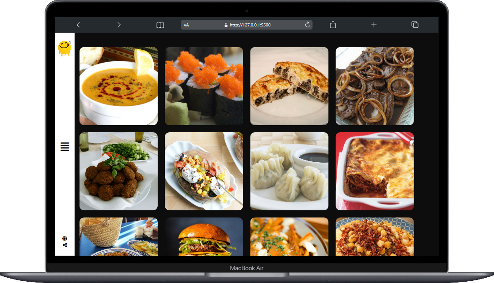
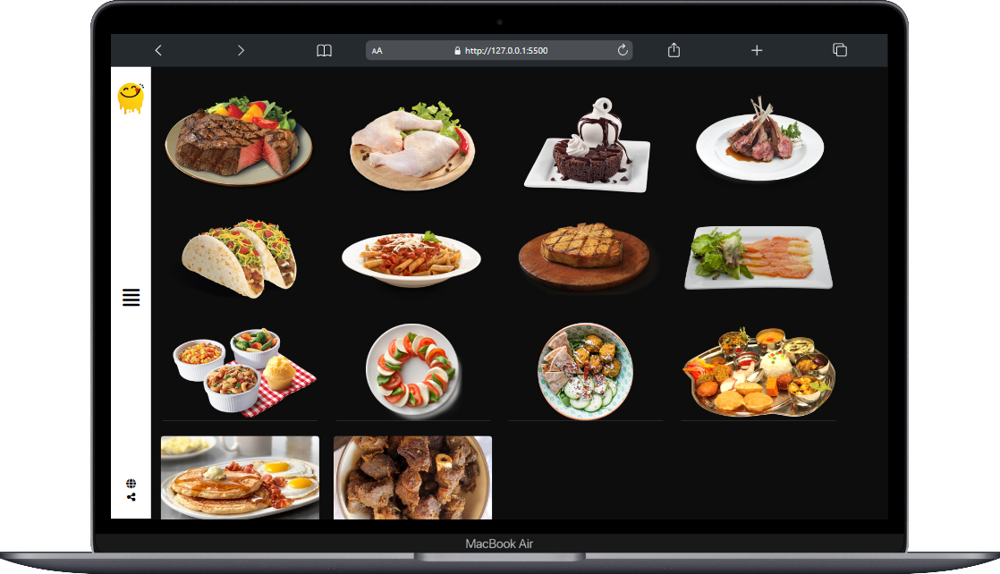
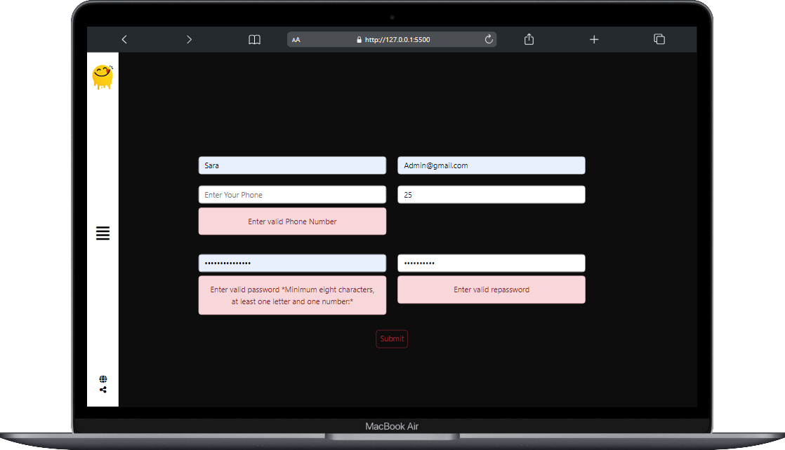

# Yummy Food App

## Technologies Used

   

.png)

## Author

- Sara Mabrouk
- GitHub: [sara-mabrouk](https://github.com/sara-mabrouk)

## Project Deployment

Visit the [Yummy](https://sara-mabrouk.github.io/Yummy/) deployed on GitHub Pages.
